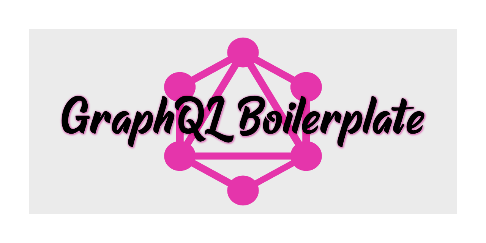

[](https://beerpay.io/matt-riley/gql_boilerplate)

 [](http://commitizen.github.io/cz-cli/) 

 [](https://www.codefactor.io/repository/github/matt-riley/gql_boilerplate) [](https://codebeat.co/projects/github-com-matt-riley-gql_boilerplate-develop) [](https://lgtm.com/projects/g/matt-riley/gql_boilerplate/alerts/) [](https://lgtm.com/projects/g/matt-riley/gql_boilerplate/context:javascript)

[](https://dependabot.com)  [](https://snyk.io/test/github/matt-riley/gql_boilerplate?targetFile=package.json)

[](https://app.fossa.com/projects/git%2Bgithub.com%2Fmatt-riley%2Fgql_boilerplate?ref=badge_large) 

[](https://glitch.com/edit/#!/remix/matt-riley/gql_boilerplate)

The purpose of this repo is to provide me with a simple boilerplate for setting up a GraphQL service.

It's 'fully featured' in so much as the correct Babel plugins, directory structure and very, very basic setup is complete.

## How to use

Click the `Use this template` button (or [here](https://github.com/matt-riley/gql_boilerplate/generate)) and fill in all of the relevant fields.

Clone your new repository.

Go into the directory which contains the boilerplate:

```bash
cd <name_of_your_directory>
```

Install all of the packages:

```bash
npm install
```

Start the server:

```bash
npm start
```

This will start the server locally and GraphQL Playground will be available at [http://localhost:3000](http://localhost:3000)

The only query possible with this boilerplate is:
```
{
  me
}
```

The response should be:
```JSON
{
  "data": {
    "me": "foobar"
  }
}
```

An example instance can be found [here](https://gql-boilerplate.glitch.me/).

For more examples using this boilerplate have a look in the [GraphQL Examples](https://github.com/matt-riley/graphql_examples) repo.
